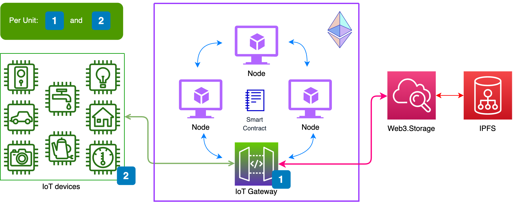

# Waffle

A Secure Firmware Dispatch System for IoT Devices using Blockchain - a MSc Thesis project by Vince Biro at the Technical University of Denmark. For more details of the project and the proposed solution, please refer to the [Thesis details](#Thesis-details) section.

#### Usage

- Requires Node v18 with npx and yarn. Make sure you run `yarn` to install dependencies, and set your ENV in `.env`.
- `yarn start`: Starts network, deploys smart contract, initalizes and starts client.
-  ⚠️ If you wish to use your own network, make sure the configuration file `config/index.ts` is set up accordingly.
- `yarn client:init`: This initializes client (copies required configs).
- `yarn solhint`: Runs Solidity linting for smart contracts.
- `yarn format`: Runs Prettier.
- `yarn lint`: Runs ESLint.
- `yarn test:upload`: Tests the upload to Filecoin using web3-storage.
- `yarn test:client`: Runs Playwright e2e tests.

### Client usage
The client is built with Svelte.
#### Initialize client
Update `./config/index.ts` with your desired configuration.
#### Development 
```bash
npm run dev

# or start the server and open the app in a new browser tab
npm run dev -- --open
```

#### Building

To create a production version of your app:

```bash
npm run build
```

You can preview the production build with `npm run preview`.

> To deploy your app, you may need to install an [adapter](https://kit.svelte.dev/docs/adapters) for your target environment.

## Thesis details

Full paper available on request - hello(at)birovince(dot)com.

### Proposed architecture


### Abstract

Internet-­of-­Things (IoT) devices have become a prevalent part of everyday life. Consequently, the need for IoT firmware security is greater than ever. Firmware dispatch systems play a crucial role in maintaining the secure operations of IoT devices. Therefore, it is essential to have robust solutions for such systems.

With the advent of blockchain and Web3 technologies, there are new ways of tackling security­related challenges. Blockchain provides a tamper­proof, secure, and distributed protocol, making it an excellent choice for firmware dispatch systems. This thesis explores the existing blockchain­based solutions for distributing IoT firmware updates. Furthermore, it proposes a secure firmware dispatch system for IoT devices using Ethereum. The system employs Web3.Storage, a hosted implementation of the InterPlanetary File System, a peer­to­peer hypermedia protocol. The proposed architecture is a fast, reliable, and scalable system that offers a protocol for validation of firmware integrity. It can benefit a wide range of manufacturers who intend to increase the security of their IoT devices.

Additionally, this work introduces a client application of the aforementioned architecture. It presents the implementation steps in detail and assesses the related technologies. Finally, it analyses the system from a security and performance perspective.